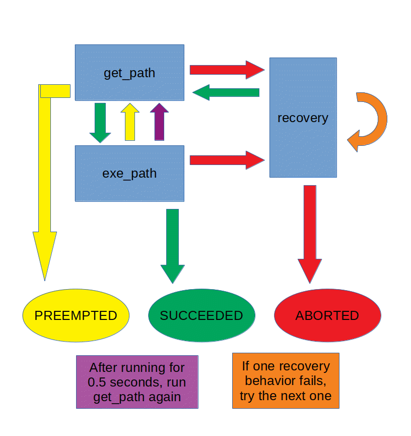

# Navigation State Machine and Waypoint Orientation

*Issue #520 and #596*

**Author:**
- Matthew Hannay

## The Problem

The two problems this intends to solve are thus:
- We want to have more control over the interactions between `get_path`, `exe_path`, and `recovery`.
- We want the orientation of the robot at the waypoints to not cause the robot to take strange paths.

## Proposed Solution

The plan is to create a `navigation_server` node that will act as the middleman between `navigation_client`,
`move_base/get_path`, `move_base/exe_path`, and `move_base/recovery`. There will also be a new actionlib message
type named `NavigateWaypoint`, which acts just like the `MoveBaseAction` message except for the inclusion of the
`fix_goal_orientation` parameter.

The implementation of the state machine is such:
- Connect to all the `get_path`, `exe_path`, and `recovery` action clients
- Send the goal waypoint to `get_path` and wait for response
    - If SUCCESS:
        - If `fix_goal_orientation` is false, send path to `exe_path`
        - Else, change the orientation of the waypoint pose to be the same as the previous pose, then send path to `exe_path`
    - If ABORTED:
        - If `recovery_enabled`, attempt pathing recovery behavior
        - Else, report what happened and abort goal
    - If PREEMPTED:
        - Report what happened, and cancel goal
    - If ANYTHING ELSE:
        - Report what happened and abort goal
- While `exe_path` runs, check on feedback
    - If oscillation is detected, cancel `exe_path` goal and run recovery behavior
    - If `time_between_get_path` has passed, run `get_path` again
- Interpret the result from `exe_path`
    - If SUCCESS:
        - Send the `navigation_client` a successful report
    - If ABORTED:
        - If `use_recovery_behavior`, attempt pathing recovery behavior
        - Else, report what happened and abort goal
    - If PREEMPTED:
        - Do nothing. This occurs when oscillation is detected and recovery behavior is running.
    - If ANYTHING ELSE:
        - Report what happened

Simplified image of the state machine:

The ellipses at the bottom represent final states, blue rectangles are actions, and the bottom rectangles describe special arrows.

## Questions & Research

Which recovery behaviors should the robot use, and what order should they be in?

Right now `stepback_and_steerturn` or `rotate_recovery` seem to be promising candidates for good recovery behavior.

## Overall Scope

### Affected Packages

- `navigation_simulation` will be modified
- `navigation_client` will be modified
- `navigation_server` will be created
- `NavigateWaypoint.action` will be created

### Schedule

