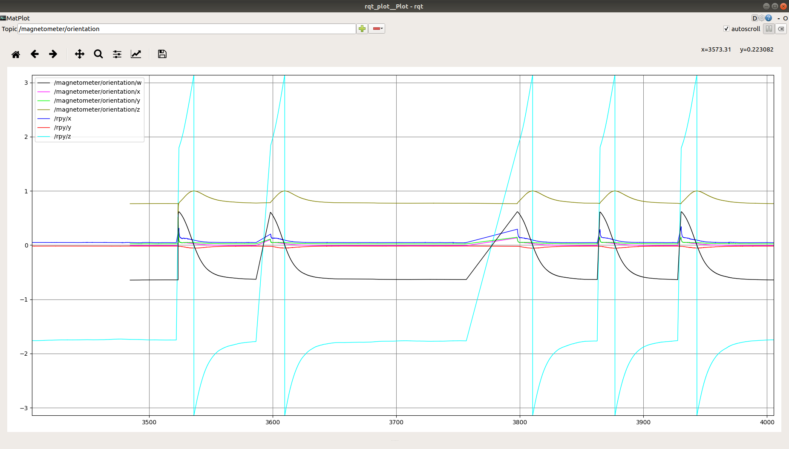

# IMU Documentation

**Author: Tan Gemicioglu**

Most of the information concerning the IMU can be found in [YostLabs' User Manual](https://yostlabs.com/wp/wp-content/uploads/pdf/3-Space-Sensor-Users-Manual-USBWT.pdf).

## Gyro Calibration and Consistency

* The IMU has a gyro calibration command to ensure that the gyro is zeroed when the robot is starting up.
However, motion during calibration ruins the process and repeated calibration results in inconsistent data.
* To fix this, there is a configuration while launching the IMU that enables or disables gyro calibration. It is disabled by default.
The `calibrate_imus.launch` file launches both IMUs with calibration toggled on.

## Convergence Problems

* Every time communication with the IMU starts (every time the driver is run), the IMU starts from an incorrect value and takes time to converge to the correct one.
This process currently takes close to a minute. This is not caused by a particular sensor, but due to the IMU's filtering mechanism.
As long as the gyro isn't recalibrated between trials, the IMU converges to the same value every time by the end of the process.
* Currently, our only options to circumvent this issue are to wait a minute after starting the sensors, do our own filtering from raw data or predict the error in the IMU's filtering.
Until we have implementations for the latter two, the current approach is to wait a minute after sensors are started.